<picture>
  <source media="(prefers-color-scheme: dark)" srcset="assets/dashboard/hero-dark.svg">
  
</picture>

  

<picture>
  <source media="(prefers-color-scheme: dark)" srcset="assets/dashboard/topics-dark.svg">
  
</picture>

  

<picture>
  <source media="(prefers-color-scheme: dark)" srcset="assets/dashboard/activity-dark.svg">
  
</picture>

 

Problems follow Striver's A2Z DSA sheet, written in Python. The cards above are generated from [`progress.json`](progress.json), so they always match what is in the repo.

## Explore

| | |
|---|---|
| **[Solutions](solutions/)** | One folder per topic. Each file is the solution as I wrote it, named for the problem. |
| **[Notes](notes/README.md)** | The trick behind each topic, and the traps that broke my own code. |
| **[Edge cases](notes/edge-cases-to-revisit.md)** | Every solution that failed on some input, with the failing input. |
| **[Questions log](questions-log.xlsx)** | Every problem in one spreadsheet: topic, difficulty, dates and review schedule. |
| **[Progress data](progress.json)** | The source of truth behind everything on this page. |

## How it works

1. Solve a problem and save it under `solutions/<topic>/`.
2. Test it against a brute-force reference on random inputs and edge cases. (Pattern-printing problems are checked by eye.)
3. Log it in `progress.json` with its topic, difficulty and review date.
4. Run `python scripts/generate_questions_log.py`, which rebuilds the spreadsheet and the cards above.

A solution that fails a check is marked `struggled` and comes back the next day. Ones that hold up return after 1, 3, 7, 14, 30 and then 60 days.
